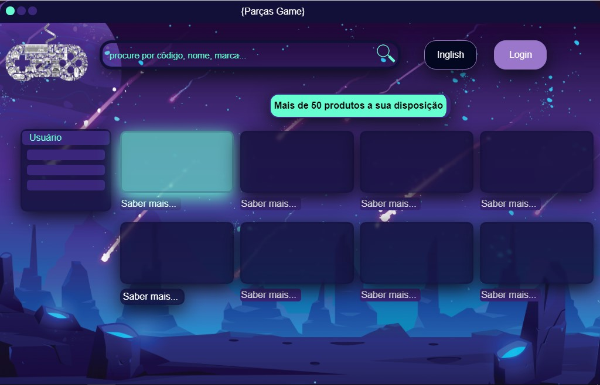
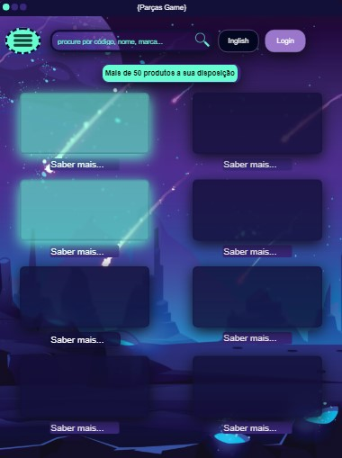

# **__Parças Developers School__**

## Desafio ui ux designer

Aqui nesse código apresento algumas funcionalidades de css e html voltada `<addr>`
a tecnologia de ux ui designer em modelo de exemplo em sua fase inicial. `<addr>`
No momento o projeto se apresenta responsivo para desktop de tela de largura 1200px `<addr>`
Ipad e Iphonex.

